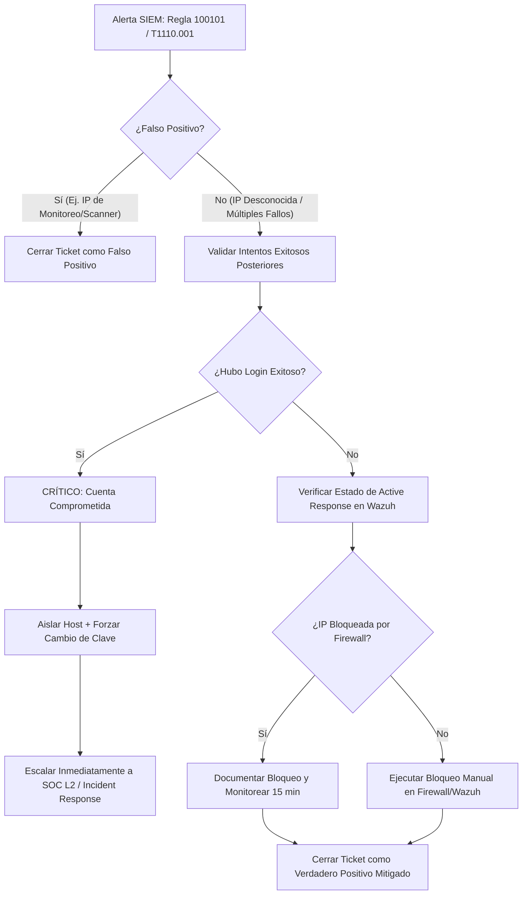

```mermaid
flowchart TD
    A[Alerta SIEM: Regla 100101 / T1110.001] --> B{¿Falso Positivo?}
    B -- Sí (Ej. IP de Monitoreo/Scanner) --> C[Cerrar Ticket como Falso Positivo]
    B -- No (IP Desconocida / Múltiples Fallos) --> D[Validar Intentos Exitosos Posteriores]
    D --> E{¿Hubo Login Exitoso?}
    E -- Sí --> F[CRÍTICO: Cuenta Comprometida]
    F --> G[Aislar Host + Forzar Cambio de Clave]
    G --> H[Escalar Inmediatamente a SOC L2 / Incident Response]
    E -- No --> I[Verificar Estado de Active Response en Wazuh]
    I --> J{¿IP Bloqueada por Firewall?}
    J -- Sí --> K[Documentar Bloqueo y Monitorear 15 min]
    J -- No --> L[Ejecutar Bloqueo Manual en Firewall/Wazuh]
    K --> M[Cerrar Ticket como Verdadero Positivo Mitigado]
    L --> M
```
